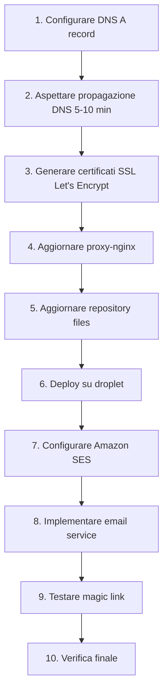

# 🔄 Piano Migrazione Dominio + Amazon SES

## Cambio Dominio

**Da**: `reportforge.bitsync.it`  
**A**: `reportforge.brainaihub.tech`

---

## 📋 Checklist Completa

### 1. ☐ Configurazione DNS (PRIORITÀ: PRIMA DI TUTTO)

**Azione**: Creare record DNS su `brainaihub.tech`

```dns
Type: A
Name: reportforge
Value: 161.35.214.46
TTL: 3600
```

**Verifica**:
```bash
dig reportforge.brainaihub.tech +short
# Deve rispondere: 161.35.214.46
```

---

### 2. ☐ File Repository da Modificare

#### 2.1 File Configurazione

| File | Path | Occorrenze | Azione |
|------|------|-----------|---------|
| `.env` | `/workspace/reportforge/.env` | 1 | ✏️ Update `APP_URL` |
| `nginx/conf.d/*.conf` | `/workspace/reportforge/nginx/conf.d/` | Multiple | ✏️ Rename file + Update `server_name` + SSL paths |
| `deploy.sh` | `/workspace/reportforge/deploy.sh` | 1 | ✏️ Update echo message |
| `README.md` | `/workspace/reportforge/README.md` | 2 | 📝 Documentation |
| `MICROAGENT_ARCHITECTURE_DEPLOY.md` | `/workspace/reportforge/docs/` | ~10 | 📝 Documentation |
| `DEPLOYMENT_GUIDE.md` | `/workspace/reportforge/DEPLOYMENT_GUIDE.md` | ~5 | 📝 Documentation |
| `RESEARCH_REPORT_AUTOMATION.md` | `/workspace/reportforge/docs/` | 3 | 📝 Documentation |

#### 2.2 Dettaglio Modifiche

**File: `.env`**
```bash
# OLD
APP_URL=https://reportforge.bitsync.it

# NEW
APP_URL=https://reportforge.brainaihub.tech
```

**File: `nginx/conf.d/reportforge.bitsync.it.conf`**
- ❌ **Eliminare**: `reportforge.bitsync.it.conf`
- ✅ **Creare**: `reportforge.brainaihub.tech.conf`
- Modificare:
  ```nginx
  server_name reportforge.brainaihub.tech;
  ssl_certificate /etc/letsencrypt/live/reportforge.brainaihub.tech/fullchain.pem;
  ssl_certificate_key /etc/letsencrypt/live/reportforge.brainaihub.tech/privkey.pem;
  ```

---

### 3. ☐ Configurazione Droplet (root@10.135.215.172)

#### 3.1 Proxy Nginx (SNI Routing)

**File**: `/opt/proxy-nginx/nginx/nginx.conf`

**Modifica**:
```nginx
# OLD
reportforge.bitsync.it           reportforge-nginx:443;

# NEW
reportforge.brainaihub.tech      reportforge-nginx:443;
```

**Comandi**:
```bash
ssh root@10.135.215.172

# Edit nginx.conf
nano /opt/proxy-nginx/nginx/nginx.conf

# Restart proxy
cd /opt/proxy-nginx
docker-compose restart nginx
```

#### 3.2 Certificati SSL Let's Encrypt

**Importante**: Certificati attuali sono per `reportforge.bitsync.it` e scadono **2026-04-08**.

**Azione**: Generare nuovi certificati per `reportforge.brainaihub.tech`

**Opzione A - Certbot Manuale**:
```bash
ssh root@10.135.215.172

# Stop nginx temporaneamente
cd /opt/reportforge
docker-compose stop nginx

# Genera certificato
certbot certonly --standalone \
  -d reportforge.brainaihub.tech \
  --email admin@brainaihub.tech \
  --agree-tos \
  --non-interactive

# Verifica certificato
ls -la /etc/letsencrypt/live/reportforge.brainaihub.tech/

# Restart nginx
docker-compose start nginx
```

**Opzione B - Certbot con DNS Challenge** (se hai API DNS):
```bash
certbot certonly --dns-digitalocean \
  -d reportforge.brainaihub.tech \
  --email admin@brainaihub.tech \
  --agree-tos
```

**Verifica certificato**:
```bash
openssl x509 -in /etc/letsencrypt/live/reportforge.brainaihub.tech/fullchain.pem -noout -dates -subject
```

#### 3.3 ReportForge Container

**File da aggiornare sul server**:
```bash
ssh root@10.135.215.172
cd /opt/reportforge

# Update .env
nano .env
# Cambiare APP_URL=https://reportforge.brainaihub.tech

# Update nginx config
cd nginx/conf.d
mv reportforge.bitsync.it.conf reportforge.brainaihub.tech.conf
nano reportforge.brainaihub.tech.conf
# Aggiornare server_name e ssl_certificate paths

# Restart container
cd /opt/reportforge
docker-compose down
docker-compose up -d
```

---

### 4. ☐ Configurazione Amazon SES

#### 4.1 Prerequisiti AWS

**Informazioni necessarie dall'utente**:
- ✅ AWS Access Key ID
- ✅ AWS Secret Access Key
- ✅ AWS Region (es. `eu-west-1`, `us-east-1`)
- ✅ SES Sender Email (es. `noreply@brainaihub.tech`)
- ✅ Verificare dominio `brainaihub.tech` su SES

#### 4.2 Verifica Dominio su AWS SES

**Step AWS Console**:
1. Vai su AWS SES Console
2. **Email Addresses** → Verify a New Email Address
   - Verifica `noreply@brainaihub.tech`
3. **Domains** → Verify a New Domain
   - Dominio: `brainaihub.tech`
   - Genera DKIM records
   - Aggiungi TXT e CNAME records sul DNS

**DNS Records da aggiungere** (esempio):
```dns
# TXT Record per verifica dominio
_amazonses.brainaihub.tech TXT "abc123xyz..."

# CNAME Records per DKIM (3 records)
xyz123._domainkey.brainaihub.tech CNAME xyz123.dkim.amazonses.com
abc456._domainkey.brainaihub.tech CNAME abc456.dkim.amazonses.com
def789._domainkey.brainaihub.tech CNAME def789.dkim.amazonses.com
```

#### 4.3 File `.env` - Aggiungi Variabili SES

**File**: `/opt/reportforge/.env`

```bash
# Amazon SES Configuration
AWS_ACCESS_KEY_ID=AKIA...
AWS_SECRET_ACCESS_KEY=wJalr...
AWS_REGION=eu-west-1
SES_SENDER_EMAIL=noreply@brainaihub.tech
SES_SENDER_NAME=ReportForge

# Email Templates
MAGIC_LINK_SUBJECT=Your ReportForge Magic Link
MAGIC_LINK_EXPIRY_MINUTES=15
```

#### 4.4 Backend - Implementazione Email Service

**File da creare**: `/backend/app/services/email_service.py`

```python
import boto3
from botocore.exceptions import ClientError
import os
import logging

logger = logging.getLogger(__name__)

class EmailService:
    def __init__(self):
        self.client = boto3.client(
            'ses',
            region_name=os.getenv('AWS_REGION'),
            aws_access_key_id=os.getenv('AWS_ACCESS_KEY_ID'),
            aws_secret_access_key=os.getenv('AWS_SECRET_ACCESS_KEY')
        )
        self.sender = os.getenv('SES_SENDER_EMAIL')
        self.sender_name = os.getenv('SES_SENDER_NAME', 'ReportForge')
    
    def send_magic_link(self, to_email: str, magic_link: str) -> bool:
        """Send magic link email via Amazon SES"""
        
        subject = os.getenv('MAGIC_LINK_SUBJECT', 'Your ReportForge Magic Link')
        
        html_body = f"""
        <html>
        <body style="font-family: Arial, sans-serif; padding: 20px;">
            <div style="max-width: 600px; margin: 0 auto;">
                <h2 style="color: #0072CE;">Welcome to ReportForge</h2>
                <p>Click the link below to access your dashboard:</p>
                <p style="margin: 30px 0;">
                    <a href="{magic_link}" 
                       style="background: #0072CE; color: white; padding: 12px 24px; 
                              text-decoration: none; border-radius: 6px; display: inline-block;">
                        Access Dashboard
                    </a>
                </p>
                <p style="color: #666; font-size: 14px;">
                    This link will expire in 15 minutes.
                </p>
                <p style="color: #666; font-size: 14px;">
                    If you didn't request this, please ignore this email.
                </p>
                <hr style="margin: 30px 0; border: none; border-top: 1px solid #ddd;">
                <p style="color: #999; font-size: 12px;">
                    ReportForge by Tinexta InfoCert<br>
                    <a href="https://reportforge.brainaihub.tech">reportforge.brainaihub.tech</a>
                </p>
            </div>
        </body>
        </html>
        """
        
        text_body = f"""
        Welcome to ReportForge
        
        Click the link below to access your dashboard:
        {magic_link}
        
        This link will expire in 15 minutes.
        
        If you didn't request this, please ignore this email.
        
        ---
        ReportForge by Tinexta InfoCert
        https://reportforge.brainaihub.tech
        """
        
        try:
            response = self.client.send_email(
                Source=f"{self.sender_name} <{self.sender}>",
                Destination={'ToAddresses': [to_email]},
                Message={
                    'Subject': {'Data': subject, 'Charset': 'UTF-8'},
                    'Body': {
                        'Text': {'Data': text_body, 'Charset': 'UTF-8'},
                        'Html': {'Data': html_body, 'Charset': 'UTF-8'}
                    }
                }
            )
            logger.info(f"Email sent to {to_email}, MessageId: {response['MessageId']}")
            return True
            
        except ClientError as e:
            logger.error(f"Failed to send email to {to_email}: {e}")
            return False

# Singleton instance
email_service = EmailService()
```

#### 4.5 Dipendenze Python

**File**: `/backend/requirements.txt`

```txt
# Aggiungi:
boto3==1.34.28
botocore==1.34.28
```

**Install**:
```bash
cd /opt/reportforge
docker-compose exec backend pip install boto3 botocore
# Oppure rebuild image
docker-compose build backend
docker-compose up -d
```

#### 4.6 Test Email Service

**Script di test**: `/backend/test_email.py`

```python
import os
import sys
sys.path.append('/app')

from app.services.email_service import email_service

# Test
result = email_service.send_magic_link(
    to_email="test@example.com",
    magic_link="https://reportforge.brainaihub.tech/auth/verify?token=abc123"
)

print(f"Email sent: {result}")
```

**Esegui test**:
```bash
docker-compose exec backend python test_email.py
```

---

### 5. ☐ Implementazione Magic Link Authentication

#### 5.1 Database - Tabella `auth_tokens`

**Already exists** in schema:
```sql
CREATE TABLE auth_tokens (
    id SERIAL PRIMARY KEY,
    user_id INTEGER REFERENCES users(id),
    token VARCHAR(255) UNIQUE NOT NULL,
    expires_at TIMESTAMP NOT NULL,
    used BOOLEAN DEFAULT FALSE,
    created_at TIMESTAMP DEFAULT CURRENT_TIMESTAMP
);
```

#### 5.2 API Endpoint - POST `/api/auth/magic-link`

**File**: `/backend/app/api/auth.py`

```python
from fastapi import APIRouter, HTTPException, Depends
from pydantic import BaseModel, EmailStr
from sqlalchemy.orm import Session
from datetime import datetime, timedelta
import secrets
import hashlib

from app.database import get_db
from app.models.user import User
from app.models.auth_token import AuthToken
from app.services.email_service import email_service

router = APIRouter(prefix="/api/auth", tags=["Authentication"])

class MagicLinkRequest(BaseModel):
    email: EmailStr

@router.post("/magic-link")
async def send_magic_link(request: MagicLinkRequest, db: Session = Depends(get_db)):
    """
    Send magic link to user email
    """
    email = request.email.lower().strip()
    
    # Find or create user
    user = db.query(User).filter(User.email == email).first()
    if not user:
        # Auto-create user on first login (optional)
        user = User(email=email, is_active=True)
        db.add(user)
        db.commit()
        db.refresh(user)
    
    # Generate secure token
    raw_token = secrets.token_urlsafe(32)
    token_hash = hashlib.sha256(raw_token.encode()).hexdigest()
    
    # Create auth token (expires in 15 minutes)
    expires_at = datetime.utcnow() + timedelta(minutes=15)
    auth_token = AuthToken(
        user_id=user.id,
        token=token_hash,
        expires_at=expires_at,
        used=False
    )
    db.add(auth_token)
    db.commit()
    
    # Build magic link
    magic_link = f"{os.getenv('APP_URL')}/auth/verify?token={raw_token}"
    
    # Send email
    success = email_service.send_magic_link(email, magic_link)
    
    if not success:
        raise HTTPException(status_code=500, detail="Failed to send email")
    
    return {
        "message": "Magic link sent successfully",
        "email": email
    }
```

#### 5.3 API Endpoint - GET `/auth/verify`

```python
@router.get("/verify")
async def verify_magic_link(token: str, db: Session = Depends(get_db)):
    """
    Verify magic link token and create session
    """
    # Hash token
    token_hash = hashlib.sha256(token.encode()).hexdigest()
    
    # Find token in database
    auth_token = db.query(AuthToken).filter(
        AuthToken.token == token_hash,
        AuthToken.used == False,
        AuthToken.expires_at > datetime.utcnow()
    ).first()
    
    if not auth_token:
        raise HTTPException(status_code=400, detail="Invalid or expired token")
    
    # Mark as used
    auth_token.used = True
    db.commit()
    
    # Create session (JWT or cookie)
    # TODO: Implement session management
    
    # Redirect to dashboard
    return RedirectResponse(url="/dashboard")
```

---

### 6. ☐ Ordine di Esecuzione

**Sequenza corretta**:



**Step by step**:

1. ✅ **DNS**: Creare record A per `reportforge.brainaihub.tech`
2. ⏳ **Aspettare**: 5-10 minuti per propagazione DNS
3. ✅ **SSL**: Generare certificati Let's Encrypt
4. ✅ **Proxy**: Aggiornare `/opt/proxy-nginx/nginx/nginx.conf`
5. ✅ **Repo**: Update all files nel repository
6. ✅ **Deploy**: Push e deploy su droplet
7. ✅ **SES**: Configurare dominio su AWS SES
8. ✅ **Code**: Implementare email service
9. ✅ **Test**: Testare invio email
10. ✅ **Verify**: Accesso completo al sistema

---

### 7. ☐ Script di Migrazione Automatica

**File**: `/workspace/reportforge/scripts/migrate_domain.sh`

```bash
#!/bin/bash

OLD_DOMAIN="reportforge.bitsync.it"
NEW_DOMAIN="reportforge.brainaihub.tech"

echo "🔄 ReportForge Domain Migration"
echo "================================"
echo "FROM: $OLD_DOMAIN"
echo "TO:   $NEW_DOMAIN"
echo ""

# 1. Update repository files
echo "📝 Updating repository files..."

# .env
sed -i "s|$OLD_DOMAIN|$NEW_DOMAIN|g" .env

# nginx config
cd nginx/conf.d
mv ${OLD_DOMAIN}.conf ${NEW_DOMAIN}.conf 2>/dev/null || true
sed -i "s|$OLD_DOMAIN|$NEW_DOMAIN|g" ${NEW_DOMAIN}.conf
cd ../..

# deploy.sh
sed -i "s|$OLD_DOMAIN|$NEW_DOMAIN|g" deploy.sh

# Documentation
find . -name "*.md" -type f -exec sed -i "s|$OLD_DOMAIN|$NEW_DOMAIN|g" {} \;

echo "✅ Repository files updated"

# 2. Commit changes
echo ""
echo "💾 Committing changes..."
git add -A
git commit -m "Migrate domain from $OLD_DOMAIN to $NEW_DOMAIN

- Update all configuration files
- Update documentation
- Update nginx configs
- Update .env variables

Co-authored-by: openhands <openhands@all-hands.dev>"

git push origin main

echo "✅ Changes committed and pushed"
echo ""
echo "⚠️  MANUAL STEPS REQUIRED:"
echo "1. Configure DNS A record for $NEW_DOMAIN"
echo "2. Wait 5-10 minutes for DNS propagation"
echo "3. Run: ./scripts/update_droplet.sh"
echo "4. Configure Amazon SES"
```

**File**: `/workspace/reportforge/scripts/update_droplet.sh`

```bash
#!/bin/bash

NEW_DOMAIN="reportforge.brainaihub.tech"
DROPLET_IP="10.135.215.172"
DROPLET_USER="root"
DROPLET_PASS="Fr3qu3nc1."

echo "🚀 Updating Droplet Configuration"
echo "=================================="

# 1. Update proxy-nginx
echo "📝 Updating proxy-nginx..."
sshpass -p "$DROPLET_PASS" ssh -o StrictHostKeyChecking=no $DROPLET_USER@$DROPLET_IP << 'EOF'
    sed -i "s|reportforge.bitsync.it|reportforge.brainaihub.tech|g" /opt/proxy-nginx/nginx/nginx.conf
    cd /opt/proxy-nginx
    docker-compose restart nginx
    echo "✅ Proxy updated and restarted"
EOF

# 2. Generate SSL certificate
echo ""
echo "🔒 Generating SSL certificate..."
sshpass -p "$DROPLET_PASS" ssh -o StrictHostKeyChecking=no $DROPLET_USER@$DROPLET_IP << EOF
    cd /opt/reportforge
    docker-compose stop nginx
    
    certbot certonly --standalone \
        -d $NEW_DOMAIN \
        --email admin@brainaihub.tech \
        --agree-tos \
        --non-interactive
    
    docker-compose start nginx
    echo "✅ SSL certificate generated"
EOF

# 3. Deploy new version
echo ""
echo "📦 Deploying new version..."
cd /workspace/reportforge
./deploy.sh

echo ""
echo "✅ Migration complete!"
echo ""
echo "🔗 New URL: https://$NEW_DOMAIN"
echo ""
echo "⚠️  Next: Configure Amazon SES"
```

---

### 8. ☐ Verifica Post-Migrazione

**Checklist finale**:

```bash
# 1. DNS Resolution
dig reportforge.brainaihub.tech +short
# Expected: 161.35.214.46

# 2. SSL Certificate
curl -vI https://reportforge.brainaihub.tech 2>&1 | grep "subject:"
# Expected: subject: CN=reportforge.brainaihub.tech

# 3. Health Check
curl -s https://reportforge.brainaihub.tech/health
# Expected: {"status":"healthy","service":"ReportForge","environment":"production"}

# 4. API Docs
curl -s https://reportforge.brainaihub.tech/api/docs | grep "swagger"
# Expected: HTML with Swagger UI

# 5. Test Magic Link
curl -X POST https://reportforge.brainaihub.tech/api/auth/magic-link \
  -H "Content-Type: application/json" \
  -d '{"email":"test@brainaihub.tech"}'
# Expected: {"message":"Magic link sent successfully","email":"test@brainaihub.tech"}
```

---

## 📧 Amazon SES - Informazioni da Fornire

**L'utente deve fornire**:

1. ✅ **AWS Access Key ID**
2. ✅ **AWS Secret Access Key**
3. ✅ **AWS Region** (es. `eu-west-1`)
4. ✅ **SES Sender Email** (es. `noreply@brainaihub.tech`)
5. ✅ **DNS Access** per aggiungere record TXT/CNAME per verifica dominio

---

## 🎯 Summary

**File da modificare nel repository**: 11 files
**Configurazioni droplet**: 2 locations
**Certificati SSL**: Rigenerare
**Amazon SES**: Setup completo
**Tempo stimato**: 30-45 minuti

**Pronto per procedere quando riceverai le credenziali AWS SES! 🚀**
